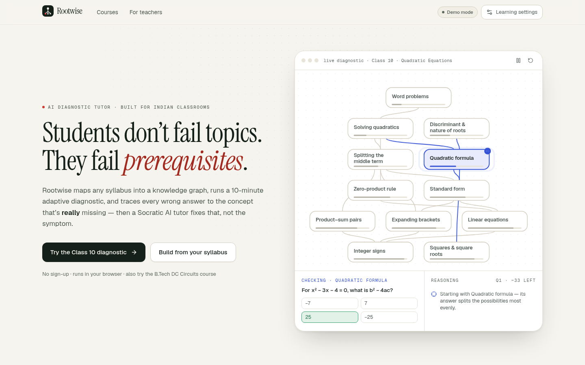
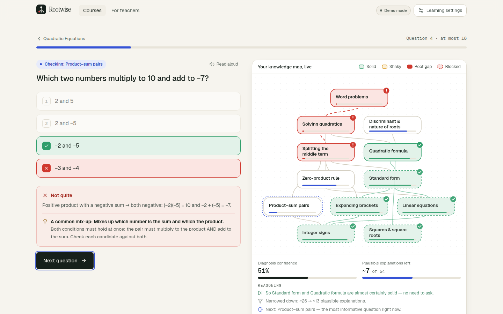
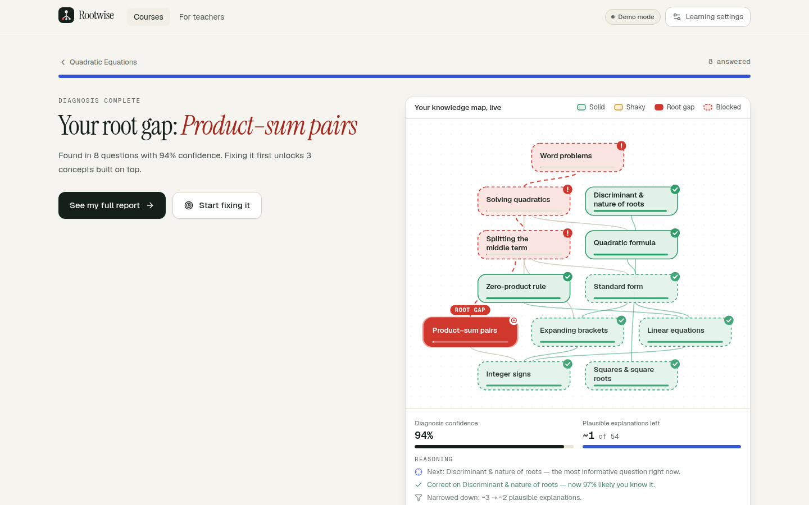
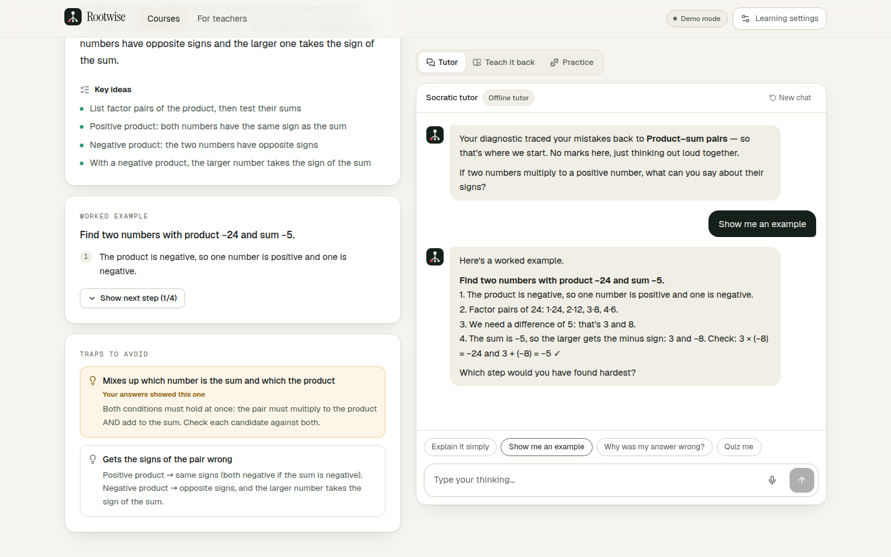
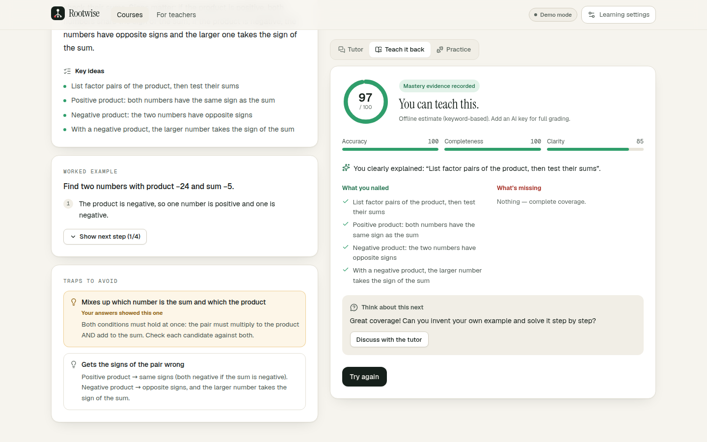
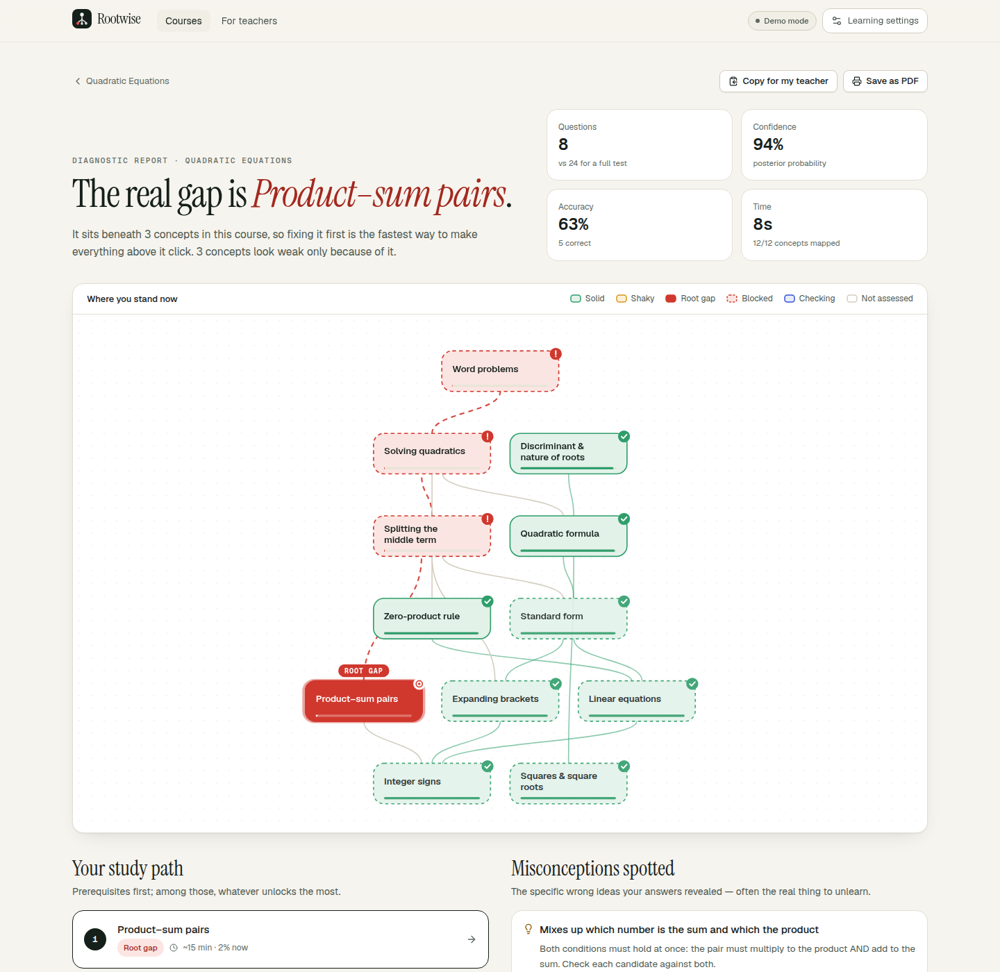
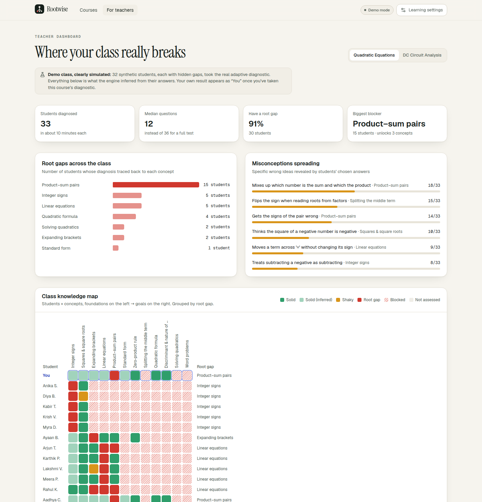
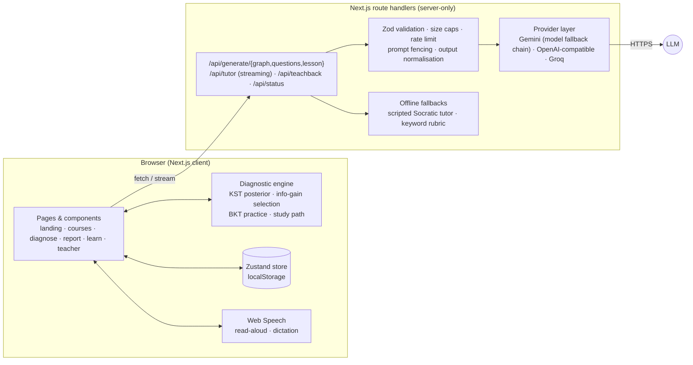

<div align="center">

# Rootwise

### Students don't fail topics. They fail *prerequisites*.

**An AI diagnostic tutor that traces every wrong answer to the concept that's really missing — then teaches exactly that.**

[](https://github.com/garvitguptark/rootwise/actions/workflows/ci.yml)


[Live demo](#-try-it) · [How it works](#-how-it-works) · [The science](#-the-science) · [Benchmark](#-benchmark) · [Architecture](#-architecture) · [Run locally](#-run-locally)



</div>

---

## 🎯 The problem

A Class 10 student scores 42% in *Quadratic Equations*. The usual response is to re-teach quadratics. But the real break is often three steps below — sign rules, expanding brackets, **finding two numbers with a given product and sum** — learnt years earlier and never checked again. Re-teaching the topic fixes nothing, and the gap compounds into every chapter that follows.

Tests tell you **what** a student got wrong. They never tell you **why**.

## 💡 The idea

Rootwise models a subject as a **prerequisite graph** and runs a **10-minute adaptive diagnostic** that walks down that graph wherever the student struggles. It finds the **root gap** — the lowest concept that's missing — separates it from the concepts that only *look* weak because they're built on it, names the **specific misconception** behind each wrong answer, and then hands the student to a **Socratic AI tutor** that works on that gap and nothing else.

> “Your root gap is **Product–sum pairs**, three steps below your goal. Misconception: *gets the signs of the pair wrong*. Fixing it unlocks 3 concepts. Found in 8 questions, 94% confident.”

## ▶️ Try it

- **Live demo:** _add your Vercel URL here_
- No sign-up. Both built-in courses, the adaptive engine, the teacher dashboard and an offline tutor work **without any API key**.
- Add a free Gemini key to unlock AI course generation from any syllabus, the AI Socratic tutor, and AI-graded teach-back in 7 Indian languages.

Two ready-made courses so any judge can relate:

| Course | Audience | Concepts | Questions |
|---|---|---|---|
| Quadratic Equations | CBSE Class 10 | 12 | 48 · 29 named misconceptions · 68% of wrong options tagged |
| DC Circuit Analysis | B.Tech Year 1 (BEEE) | 12 | 48 · 24 named misconceptions · 64% of wrong options tagged |

## 🧭 How it works

| | | |
|---|---|---|
| **1. Map** | Any topic or pasted syllabus → a prerequisite graph, including the earlier-grade skills that silently break it, plus the common misconceptions for each concept. | AI + validation |
| **2. Diagnose** | Adaptive test. Every question is the one with the **highest expected information gain**. The live map lights up as evidence arrives: a right answer clears everything *under* it; a wrong one marks everything *above* it as shaky and sends the search down to find the cause. | Knowledge Space Theory + Bayes |
| **3. Repair** | A Socratic tutor grounded in the diagnosis — the root gap, the misconceptions shown, the exact questions missed. It asks; it doesn't lecture. | LLM, streamed |
| **4. Prove it** | Teach-back (Feynman technique): explain it in your own words — typed or spoken, in your language — and get graded on accuracy, completeness and clarity. Practice updates mastery with Bayesian Knowledge Tracing. | LLM rubric + BKT |

<table>
<tr>
<td width="50%"><br/><sub><b>Diagnose</b> — the live map, confidence and “plausible explanations left”, with the reasoning log.</sub></td>
<td width="50%"><br/><sub><b>Root gap found</b> in 8 questions: blocked concepts are shown as symptoms, not causes.</sub></td>
</tr>
<tr>
<td><br/><sub><b>Repair</b> — lesson, worked example with step-by-step reveal, the student's own misconceptions, and a Socratic tutor.</sub></td>
<td><br/><sub><b>Prove it</b> — teach-back graded on accuracy, completeness and clarity.</sub></td>
</tr>
<tr>
<td><br/><sub><b>Report</b> — root gap, misconceptions, ordered study path, every answer reviewable; save as PDF or copy for a teacher.</sub></td>
<td><br/><sub><b>For teachers</b> — root gaps across a class, spreading misconceptions, a student × concept heatmap, and small groups for tomorrow's lesson.</sub></td>
</tr>
</table>

## 🔬 The science

Rootwise is not a prompt wrapper. The diagnosis is done by a deterministic, explainable engine; the LLM is used for what LLMs are good at (writing content, conversation, grading free text) and everything it produces is validated before the engine touches it.

**Knowledge Space Theory** (Doignon & Falmagne — the model behind ALEKS). A student's knowledge state is a set of concepts *closed under prerequisites*: you can't know Factorising without Integer signs. Rootwise enumerates every feasible state (54 for the quadratics graph, 60 for circuits; capped at 60,000) and keeps an **exact Bayesian posterior** over them.

- **Likelihood.** P(correct | knows) = 1 − slip, P(correct | doesn't) = guess. Hard questions are less guessable; an honest *“I'm guessing”* tap raises the guess rate so a lucky answer counts for less.
- **Prior (Occam's razor).** P(state) ∝ 0.3^|root gaps| — explanations with fewer root causes are preferred.
- **Question selection.** The next question maximises the mutual information between the answer and the knowledge state: `I = H(p·(1−s) + (1−p)·g) − [p·H(s) + (1−p)·H(g)]` — effectively a noisy binary search over the graph.
- **Stopping.** When the most likely diagnosis reaches 90% posterior probability (or the budget of 1.5 × concepts is used).
- **Root gaps** are the *outer fringe* of the most likely state: unknown concepts whose prerequisites are all known. Unknown concepts above them are reported as **blocked**, not as separate problems.

**Misconception-tagged distractors.** Two-thirds of the wrong options in the built-in courses (190 of 288) are tagged with the specific wrong belief they reveal (“Thinks (a + b)² = a² + b²”, “Uses P = V/I”). Cross-concept tags let a mistake on the quadratic formula surface a *squares* misconception — root cause again.

**Bayesian Knowledge Tracing** (Corbett & Anderson) updates mastery during practice, with a learning-transition term; a strong teach-back counts as evidence too.

A depth-first BKT engine is kept as a fallback for unusually wide AI-generated graphs.

## 📊 Benchmark

Does the adaptive engine actually find the right root gap? We ran the real engine against **2,000 simulated students per course**. Each has 0 (10%), 1 (60%) or 2 (30%) hidden knowledge holes — plus everything built on them — slips 10% of the time on concepts they know, and guesses (1 in 4) on ones they don't.

| Method | Exact diagnosis | Root-gap recall | Precision | Questions |
|---|---:|---:|---:|---:|
| **Rootwise** (adaptive, KST + Bayes) | **82.2% / 82.6%** | 86.1% / 86.0% | 83.8% / 83.7% | **13.8** |
| Fixed test, 3 questions per concept | 53.5% / 62.9% | 81.5% / 81.4% | 56.5% / 60.2% | 36 |
| Fixed test, 2 questions per concept | 35.4% / 40.3% | 55.0% / 54.9% | 39.2% / 41.3% | 24 |
| Fixed test, 1 question per concept | 25.3% / 31.4% | 66.5% / 66.3% | 36.0% / 38.2% | 12 |

<sub>Quadratics / Circuits. “Exact” = the reported root gaps are exactly the true ones. Fixed tests call a concept known when at least half its answers are right, and a root gap when it's unknown with all prerequisites known.</sub>

Reproduce it: `npm run benchmark`. **Caveat:** these are simulated students under a stated noise model, not a classroom study — the benchmark shows the inference is sound and efficient; real-world validation is the next step.

## 🌏 Built for Indian classrooms

- **7 languages** for the tutor, lessons and feedback: English, हिन्दी, தமிழ், తెలుగు, বাংলা, मराठी, ಕನ್ನಡ. Students can mix languages (Hinglish) and the tutor mirrors them.
- **Voice in, voice out** (Web Speech API): questions and lessons read aloud with maths made speakable (“x squared”, “plus or minus”); explain concepts out loud for teach-back.
- **Readable mode** with Atkinson Hyperlegible (designed for low vision), adjustable text size, dark mode, reduced-motion support, full keyboard control (1–4 to answer, Enter, G for guessing).
- **Relatable examples** (₹, cricket, trains) in the tutor's instructions.
- **No account, low data:** progress lives on the device; the diagnostic runs entirely in the browser; an offline tutor keeps working without AI.

## 🏗️ Architecture



**Key decisions**

- **The engine runs client-side.** Diagnosis is instant (no network round-trip per answer), works offline, costs nothing per student, and the maths is inspectable.
- **AI output is untrusted input.** Generated graphs are slug-normalised, dangling references resolved by id *or* name, cycles broken, goals re-derived from sinks; questions are de-duplicated, answer keys range-checked, options shuffled deterministically (LLMs love option A), unknown misconception tags dropped. Then the whole course goes through the same validator as the hand-written ones.
- **Two-stage generation** (graph first, then question batches in parallel, lessons lazily on first visit) keeps each request short, gives a live progress UI, and stays within serverless time limits.
- **Graceful degradation everywhere.** Tutor and teach-back fall back to offline modes if the provider fails; Gemini falls back across models (404/429/5xx) and retries without `thinkingConfig` if a model rejects it; a rejected key produces an actionable error.
- **Provider-agnostic over plain `fetch`** — no SDK lock-in; any OpenAI-compatible endpoint works.

### Project structure

```
src/
  app/                      Next.js App Router pages + API route handlers
    api/generate/…          graph · questions · lesson (JSON mode)
    api/tutor               streaming Socratic tutor
    api/teachback           Feynman-style grading
    courses/[courseId]/…    overview · diagnose · report · learn/[conceptId]
    teacher/                class dashboard
  components/               KnowledgeGraph (custom SVG layout), QuestionCard, TraceLog, learn/*
  content/                  hand-authored courses (quadratics, circuits)
  lib/
    engine/                 kst.ts · dfs.ts · bkt.ts · graph.ts · analysis.ts · simulate.ts
    ai/                     provider.ts · prompts.ts · normalize.ts
    schema.ts               Zod domain model + API contracts
    course-validation.ts    semantic course checks (ids, references, acyclicity, coverage)
    offline.ts              no-AI tutor and teach-back fallbacks
  store/app.ts              persisted client state
scripts/                    benchmark · content validation · mock OpenAI/Gemini server
tests/                      Vitest unit tests (engine, AI normalisation, prompts, offline)
e2e/                        Playwright end-to-end tests (run against the mock LLM)
```

## 🚀 Run locally

```bash
git clone https://github.com/garvitguptark/rootwise.git
cd rootwise
npm install
cp .env.example .env.local      # optional: add GEMINI_API_KEY for AI features
npm run dev                     # http://localhost:3000
```

Requires Node 20.9+.

### Deploy to Vercel

1. Push the repo to GitHub and import it at [vercel.com/new](https://vercel.com/new) (framework auto-detected).
2. Add the environment variable `GEMINI_API_KEY` (free at [aistudio.google.com/apikey](https://aistudio.google.com/apikey)).
3. Deploy. That's it — no database, no other services.

### AI providers

| Variable | Purpose |
|---|---|
| `GEMINI_API_KEY` | Google Gemini (recommended, free tier). Tries `gemini-3.5-flash` → `gemini-flash-latest` → `gemini-3.1-flash-lite`. |
| `GEMINI_MODEL`, `GEMINI_THINKING` | Pin a model; reasoning depth for Gemini 3.x (`low` by default, `off` to omit). |
| `OPENAI_API_KEY`, `OPENAI_BASE_URL`, `OPENAI_MODEL` | OpenAI or any OpenAI-compatible API (OpenRouter, Together, vLLM…). |
| `GROQ_API_KEY`, `GROQ_MODEL` | Groq. |
| `AI_PROVIDER` | Force `gemini`, `openai`, `groq` or `demo`. |

## ✅ Quality

```bash
npm run check        # eslint + tsc --noEmit + 37 unit tests + content validation
npm run benchmark    # diagnostic accuracy on simulated students
npm run test:e2e     # 7 Playwright tests incl. mobile, against a mock LLM (no key needed)
npm run build
```

- **Unit tests** cover the graph algorithms, BKT maths, knowledge-space enumeration (every state is prerequisite-closed), end-to-end diagnoses of scripted students, persistence round-trips, the benchmark gate (adaptive must beat a 36-question fixed test with under half the questions), AI-output normalisation, prompt-injection fencing, and the offline fallbacks.
- **End-to-end tests** run the real app against `scripts/mock-llm.mjs` — an OpenAI- *and* Gemini-compatible mock that also simulates model-not-found and rejected-parameter errors to exercise the fallbacks.
- **Accessibility:** axe-core reports **0 violations** (WCAG 2 A/AA + best practices) on every main page in light and dark themes. Status colours were validated for colour-vision deficiency and always ship with a label or icon.
- **CI** (GitHub Actions) runs everything above on every push.

## 🔐 Security & privacy

- API keys are server-only (`server-only` imports); the client only learns *whether* AI is live.
- All request bodies are schema-validated with size caps; per-IP rate limiting on AI routes.
- Learner-supplied text (syllabi, explanations) is fenced and labelled as data in prompts to resist prompt injection.
- No accounts and no database: a student's diagnostics and progress stay in their browser.
- Security headers (HSTS, nosniff, frame and permissions policies; microphone only for voice answers).

## 🗺️ Roadmap

- Classroom codes so real students' diagnostics flow into the teacher dashboard (with school-level privacy controls).
- Calibrating slip/guess per question from real response data (IRT), and a classroom validation study.
- Photo-of-handwritten-working input to catch the exact wrong step.
- Full UI localisation (the tutor and content are already multilingual).

## License

MIT. Fonts: Geist, Geist Mono, Instrument Serif and Atkinson Hyperlegible under the SIL Open Font License.
